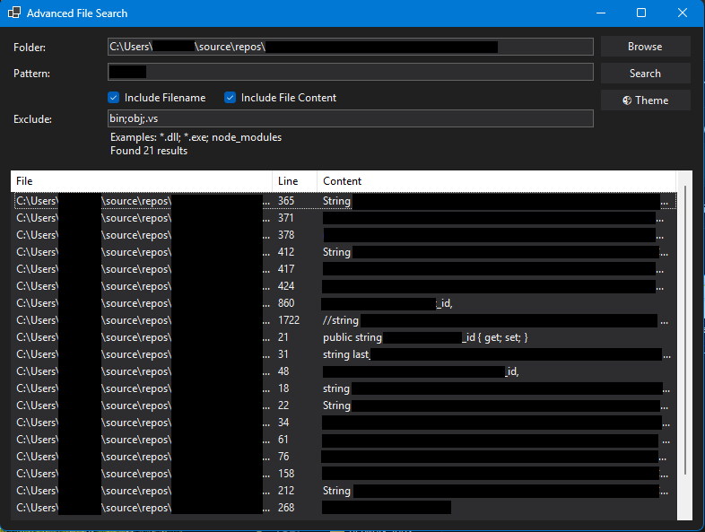

# Advanced File Search

This application provides an efficient way to search through file names and content in a specified folder. It combines regex-based pattern matching with optional content filtering, allowing quick, targeted discovery of relevant files across large directories.

## Key Features
- Recursive directory search for matching filenames or text content.
- Regex support for flexible filtering.
- Easy exclusion of certain files or folders (e.g. `node_modules`, `*.dll`).
- Light/dark theme toggle.

## AI Collaboration
This project is purely an AI-driven endeavor, developed in close cooperation with **ChatGPT o1** and **Claude Sonnet**. Their combined insights helped shape and refine every aspect of the code, from the architecture down to the user interface details.

## Usage
1. Select a target folder.
2. Enter a regex pattern for the desired matches.
3. Optionally configure file/folder exclusions (e.g. `node_modules; *.exe; ...`).
4. Specify whether to search in filenames, file content, or both.
5. Click **Search** to retrieve matching entries, then browse results in the built-in list view.

Enjoy exploring and indexing your files more effectively!
